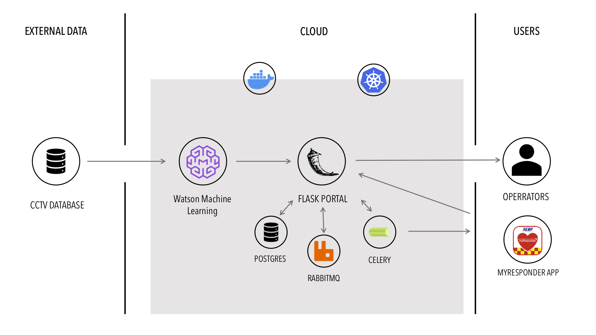

# PORTAL

[](https://www.apache.org/licenses/LICENSE-2.0) [](https://callforcode.org/slack) [](https://code-and-response.github.io/Project-Sample/)

A solution for the SCDF-IBM Lifesavers' Innovation Challenge

## Contents

1. [Short description](#short-description)
1. [Demo video](#demo-video)
1. [The architecture](#the-architecture)
1. [Long description](#long-description)
1. [Project roadmap](#project-roadmap)
1. [Getting started](#getting-started)
1. [Running the tests](#running-the-tests)
1. [Live demo](#live-demo)
1. [Built with](#built-with)
1. [Contributing](#contributing)
1. [Versioning](#versioning)
1. [Authors](#authors)
1. [License](#license)
1. [Acknowledgments](#acknowledgments)

## Short description

### What's the problem?

Currently the mobilisation of CFRs allows for early intervention in cases of cardiac arrests and fires. However, the notifications on the myResponder app are only sent out after SCDF gets notified of an accident (when it is being reported by members of public). In such a case, there may be a significant lag time in the time taken for the incident to be reported and also in the time taken for a case to be accepted by CFRs. However, in such emergencies, the first few minutes are crucial, and it is of utmost importance that we detect these issues immediately, especially as the elderly population grows older — after all, such accidents happen more frequently to the elderly population, and they are less likely to survive them. In particular, elderly with no next of kin tend to go out alone, and if there are no passersby, they may not be detected for prolonged periods of time. This presents a potential gap in the immediate aid they should be able to receive. As such, we believe that this is an area that technology can be used to mitigate such a gap, to effectively leverage on the strengths of the CFRs to provide early intervention to such accidents. 

Whilst we understand that a proportion of incidents with elderly with no next of kin may happen in homes, we believe that the mobilisation of CFRs are less feasible in such cases, and hence focused on the situations where CFRs can be effectively mobilised to provide early intervention.

### How can technology help?

By leveraging on the capabilities of AI to automatically detect incidents through visual recognition, we hope to be able to tap on the vast network of CCTVs in Singapore to almost immediately be alerted at the onset of incidents which require emergency response. This minimises the lag time needed for a passerby to notice the incident and subsequently notify SCDF, allowing for assistance to be rendered more quickly.

### The idea

Our solution PORTAL, is a flask micro-service backed by IBM Visual Recognition, PostgreSQL, RabbitMQ and Celery. When an incident is detected by the AI, it will either be automatically sent to PORTAL (in the case of a fire), or alerted to a human operator for triage, and will thereafter be sent to PORTAL. PORTAL will then add the details of the event to PostgreSQL, which will call a celery task through rabbitMQ to alert myResponder app of the incident. When a community first responder (CFR) accepts the case, it will then be communicated back to PORTAL, which will update the postgreSQL database. Operators can then check PORTAL for a table of events, location, details and whether any CFRs are currently attending to the incident.

The whole solution will be implemented via Docker, coupled with Kubernates, to allow for ease of scaling up, especially as there may be huge amounts of data that the AI has to handle. Besides, there will be times (e.g. in the day), where there are more alerts and hence more instances of a micro-service may be needed at that time. 

## Demo video

[](https://youtu.be/vOgCOoy_Bx0)

## The architecture



1. CCTV data is processed using AI visual recognition to detect for fire or EMS (in the event of EMS, images will be sent to human operator for triage)
2. Upon being alerted, visual recognition software will send a POST request to PORTAL API with details of event, location and details
3. PORTAL API will insert the data into postgreSQL, which will trigger a message to be sent out on rabbitMQ, which will be consumed by celery
4. Celery will send out the alerts on the myResponder app 
5. If a CFR accepts the case, myResponder app will notify PORTAL, which will update the postgreSQL
6. To keep track of the events detected and sent out from API, operators can check PORTAL, which will display the event, location, details and whether any CFR has accepted the case
7. To be able to easily scale up the services during periods where alert frequency may be higher, docker containers, coupled with kubernates are used 

## Long description

[More detail is available here](DESCRIPTION.md)

## Project roadmap


## Getting started

These instructions will get you a copy of the project up and running on your local machine for development and testing purposes. See deployment for notes on how to deploy the project on a live system.

### Prerequisites

What things you need to install the software and how to install them

```bash
dnf install wget
wget http://www.example.com/install.sh
bash install.sh
```

### Installing

A step by step series of examples that tell you how to get a development env running

Say what the step will be, for example

```bash
export TOKEN="fffd0923aa667c617a62f5A_fake_token754a2ad06cc9903543f1e85"
export EMAIL="jane@example.com"
dnf install npm
node samplefile.js
Server running at http://127.0.0.1:3000/
```

And repeat

```bash
curl localhost:3000
Thanks for looking at Code-and-Response!
```

End with an example of getting some data out of the system or using it for a little demo

## Running the tests

Explain how to run the automated tests for this system

### Break down into end to end tests

Explain what these tests test and why, if you were using something like `mocha` for instnance

```bash
npm install mocha --save-dev
vi test/test.js
./node_modules/mocha/bin/mocha
```

### And coding style tests

Explain what these tests test and why, if you chose `eslint` for example

```bash
npm install eslint --save-dev
npx eslint --init
npx eslint sample-file.js
```

## Live demo

You can find a running system to test at [callforcode.mybluemix.net](http://callforcode.mybluemix.net/)

## Built with

*The IBM Cloud version of PostgreSQL, rabbitMQ and Kubernates were not used when creating this solution as they were not available with our current account type.*

* IBM Visual Recognition - To detect incidents visually
* PostgreSQL - The object-relational database used
* RabbitMQ - The message-broker used for celery
* Flask - The web framework used
* Celery - The asynchronous task queue

## Contributing

Please read [CONTRIBUTING.md](CONTRIBUTING.md) for details on our code of conduct, and the process for submitting pull requests to us.

## Versioning

We use [SemVer](http://semver.org/) for versioning. For the versions available, see the [tags on this repository](https://github.com/your/project/tags).

## Authors

* **Billie Thompson** - *Initial work* - [PurpleBooth](https://github.com/PurpleBooth)

See also the list of [contributors](https://github.com/Code-and-Response/Project-Sample/graphs/contributors) who participated in this project.

## License

This project is licensed under the Apache 2 License - see the [LICENSE](LICENSE) file for details

## Acknowledgments

* Based on [Billie Thompson's README template](https://gist.github.com/PurpleBooth/109311bb0361f32d87a2).
